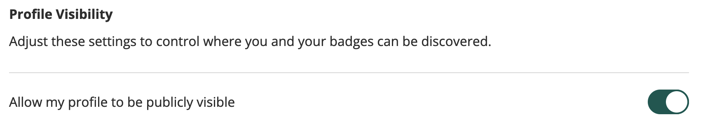

# Go Credly API Data Fetcher

[](CHANGELOG.md)
[](https://github.com/shanilhirani/go-credly/releases)
[](https://pkg.go.dev/github.com/shanilhirani/go-credly)
[](go.mod)
[](LICENSE)
[](https://github.com/shanilhirani/go-credly/actions?query=workflow%3Abuild+branch%3Amain)
[](https://goreportcard.com/report/github.com/shanilhirani/go-credly)
[](https://codecov.io/gh/shanilhirani/go-credly)

## About

Go-credly written in Go (hence the name) enables users to obtain Certification Badges earned on Credly's Certification Platform.

All you need is your Credly `username` and _go-credly_ will fetch data from Credly's API, filter for active badges (can be overridden) and return either a Markdown or Standard Out.

### Use case

- You could use this tool to dynamically update a CV/Resume, Portfolios and Personal Websites using a Github Action, or just running the binary on a cron to fetch your credly badges.

## Prerequisites

- Credly Account with Public Visibility enabled.
  
- [Go](https://golang.org/dl/) installed (version 1.22 or later)
- Internet connection

## Installation

Download for Binary and Docker Image TBC.

Building from Source:

```bash
1. git clone https://github.com/yourusername/go_credly.git
2. cd go_credly
3. go build
4. chmod +x ./go-credly
```

## Usage

```bash
 ./go-credly fetch -h
This command fetches user badges from the Credly API using the provided user ID or username.

Usage:
  go-credly fetch [flags]

Flags:
  -h, --help              help for fetch
  -e, --include-expired   Include expired badges
  -o, --out-file string   Write results to a file with Markdown extension. e.g BADGES.md
```

Example:

`./go-credly fetch shanilhirani`

```bash
2024/07/17 14:50:33 Displaying Credly Badges to stdout
Badge Name: AWS Certified Solutions Architect – Professional
Badge Description: Earners of this certification have an extensive understanding of designing technical strategies to accomplish specific business goals. They demonstrated the ability to balance best practices and trade-offs based on business context. Badge owners are able to design solutions across multiple platforms and providers.
Badge Image URL: https://images.credly.com/images/2d84e428-9078-49b6-a804-13c15383d0de/image.png
Badge URL: https://www.credly.com/org/amazon-web-services/badge/aws-certified-solutions-architect-professional
```

Example 2:

Creating a _CREDLY.md_ including expired badges.

`./go-credly fetch shanilhirani`

```bash
 ./go-credly fetch shanilhirani -e -o CREDLY
2024/07/17 15:00:27 Including expired badges
2024/07/17 15:00:28 Writing Credly Badges to CREDLY.md
2024/07/17 15:00:28 Credly Badges written to CREDLY.md
```

## License

This project is licensed under the MIT License. See the [LICENSE](LICENSE) file for details.

## Contributing

Contributions are welcome! Please open an issue or submit a pull request for improvements or bug fixes.

Happy Coding!
